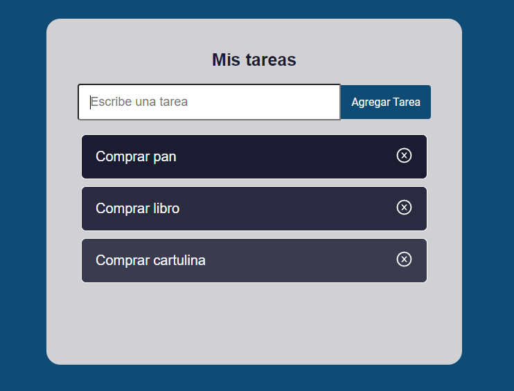

# Aplicación ToDoList con React
Aplicación de TodoList, usando useState y verificación de estados para poder marcar cada tarea hecha al seleccionarla o eliminarla.Se usaron las tecnologías:

- HTML
- CSS
- JavaScript
- React

## Capturas de la aplicación

